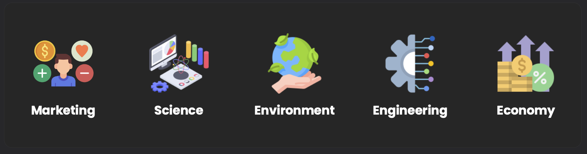

## 👤 About Me

With over 5 years of experience with data, focus on solving business problems through data approaches by utilizing advanced algorithm, building predictive models, reporting insights, arranging strategies, and pitching cross-functional teams. Strongly skilled in collaborative projects, especially dealing with revenue-related cases by aligning technical strategies that can be applicable in real business challenges. Now, I continuously seek more journey to help more teams solving their challenges through sophisticated analysis.

## 🔬 Field of Interests

In analytics, I'm really into grasping the domain knowledge first over the technical tools, focusing the clarity in order to address the real problems. Therefore, my experience ranges in these fields:

- Marketing (Customer Journey and Behaviors)
- Science (Mostly in Physics and Chemistry)
- Environment (I'm into environmental strategies to enchance the quality of live)
- Engineering (Interested in renewable energy, autopilot cars)
- Economic (Stock Analysis, Cryptocurrency)

## 📝 Resume

To see more about professional journey, please refer to my resume!


Resume

