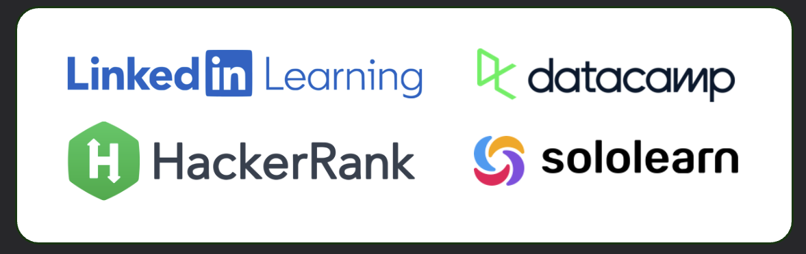

## 💼 Professional Background



---

## 🎓 Educational Background



---

## 📢 Language Proficiency



---

## 🧠 Bootcamp

| Tracks                                    | Date         | Issued By |
|-------------------------------------------|--------------|-----------|
| Safe AI Practices                         | Sep 2025     | LinkedIn  |
| Using Generative AI Ethically at Work     | Aug 2025     | LinkedIn  |
| Product Management : Customer Development | July 2025    | LinkedIn  |
| Business Ethics                           | July 2025    | LinkedIn  |
| Data Analyst with Python Track            | 28 Apr 2022  | Datacamp  |
| Data Analyst with SQL Server Track        | 28 Feb 2022  | Datacamp  |
| Data Engineer in Python                   | 23 Jan 2022  | Datacamp  |
| Python Programmer                         | 7 Dec 2021   | Datacamp  |
| ata Science                               | 4 July 2021  | Sololearn |
| Machine Learning                          | 11 July 2021 | Sololearn |
| SQL                                       | 17 July 2021 | Sololearn |

## 🎯 Certification

| Certificate  | Date        | Issued By  |
|--------------|-------------|------------|
| SQL Advanced | 3 May 2022  | Hackerrank |
| Python       | 18 Oct 2021 | Hackerrank |

## 📝 Resume


Resume

