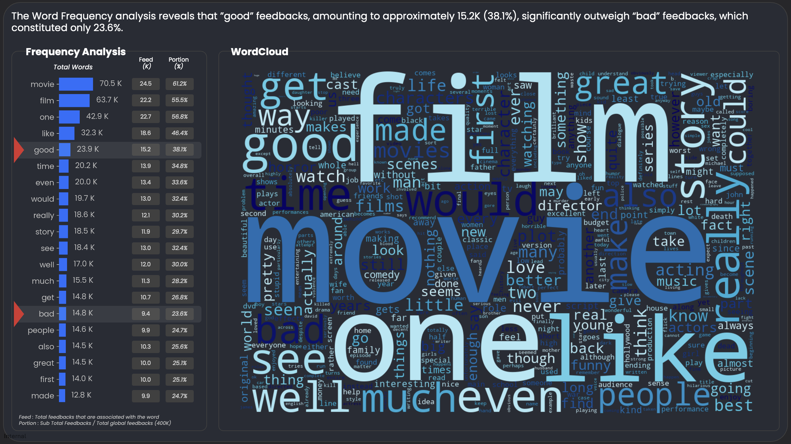
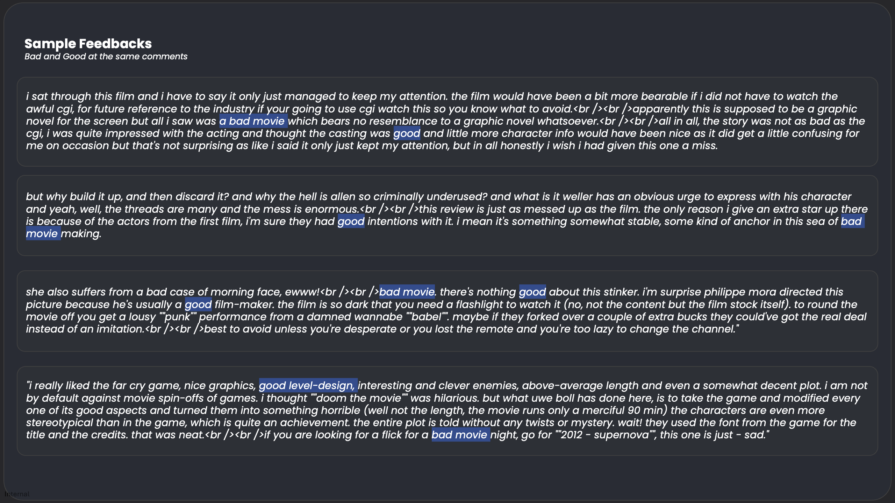


**Note** To keep it confidential, all company-specific metrics has been replaced by public dataset. 


## ❓ Background

### 👍 Why you can't use LLM to decide positive or negative feedbacks.

Tagging sentiment of feedbacks can be exhausting especially dealing with large amount of feedbacks. In addition, some companies might restrict the use of AI because of potentially revealing the secrets, unless you totally trust to AI CEO's. In another case, probably you want to train AI by creating reliable raw data. Therefore, this article is going to discuss how to annotate text sentiment by combining word-cloud and graph in python.

## 💼 Real Scenario

### 📽️ IMDb (Internet Movie Database) ratings

In this case, there are around 400K feedbacks, giving comments about their experience watching various movies. Yet, these feedbacks still require further cleansing since they are extracted using machine before directly analyzing it. To resolve this issue, I used three following methods.

| Method      | Description                                                                                                                                                                                                      |
|-------------|------------------------------------------------------------------------------------------------------------------------------------------------------------------------------------------------------------------|
| Stopwords   | Several words do not contain useful meaning, and they are typically used in every phase so they might interfere the most frequent words. Therefore, this step skips those words                                  |
| HTML syntax | as these comments are generated by machine, some coding words are detected. So, this process removes them.                                                                                                       |
| Lemmitizer  | Grammatical rules make english words having so many branches, even though the meanings remain the same. For example, "ate" and "eaten" come from "eat". Therefor, this part returns all the braches to the root. |

### ☁️ Word Frequency by WordCloud

WordCloud is a common method to understand overall feedback by analyzing the frequent words appearing in all feedbacks. The picture shows that film, movie, and one reveal many times, which are also indicated by the large font size. Focusing on positive and negative sentiment, the word "good" is identified as the fifth most frequent word (23.9 K), meanwhile the "bad" word comprises 14.6K. Therefore, initial insight is that IMDB ratings positive feedbacks compared to bad feedbacks according to the frequency.

On the other hand, "good" and "bad" words are not enough to conclude the sentiment as the context might be different, especially when the feedbacks containing both words at the same time. Likewise, those words probably refer to other aspects not directly on the movie. For instance, the feedback of "Even though the quality of the video was bad, I'd say it is a good movie as the actress ....." shows that "bad" does not refer to the movie, which can be misleading in representing the sentiment. Therefore, analyzing the relation between words is required to resolve this problem.

# 🕸️ Graph Analysis

Looking at the intersection, there are about 5.1K feedbacks containing both "good" and "bad" in the sentences. These feedbacks are going to be analyzed further by analyzing the correlation among other words. 

Before connecting the words, it is important to note the weight rule is applied in this analysis. The weight gives a level for every connection, indicating how close enough two words appeared in a sentences. In this case, high weight assumes that "good" or "bad" close enough to the "movie", so it can be assumed to decide the final sentiment. 

According to the graph, the connection between nodes indicates that the words are in the same feedback, and the width of lines represets the weight rule. The result shows for the feedbacks containing both words, connection between movie and bad is strong, meaning that the feedbacks are more likely to have negative sentiment over the positive ones. Nevertheless, this would be better to return this weight to individual feedbacks for annotating purposes. In addition, the sample of feedbacks are also provided to quick check the validation like in the picture below.

## ⚙️ Further Improvement

Further development should be considered especially handling negation phrases like “not a good movie”, and synonyms like film and movie. Such examples demonstrate that the despite strong relation but can’t affect the actual meanings whether a feedback is positive or negative.
To find out more about technical details, you can explore in my github below


View on GitHub
