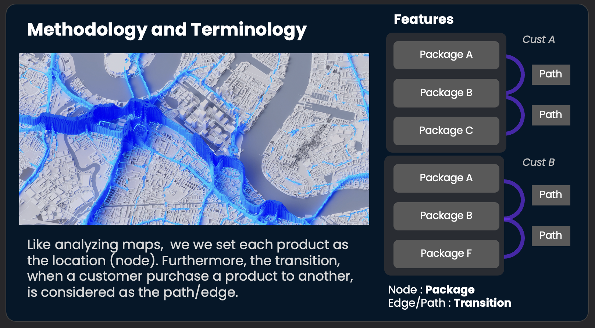
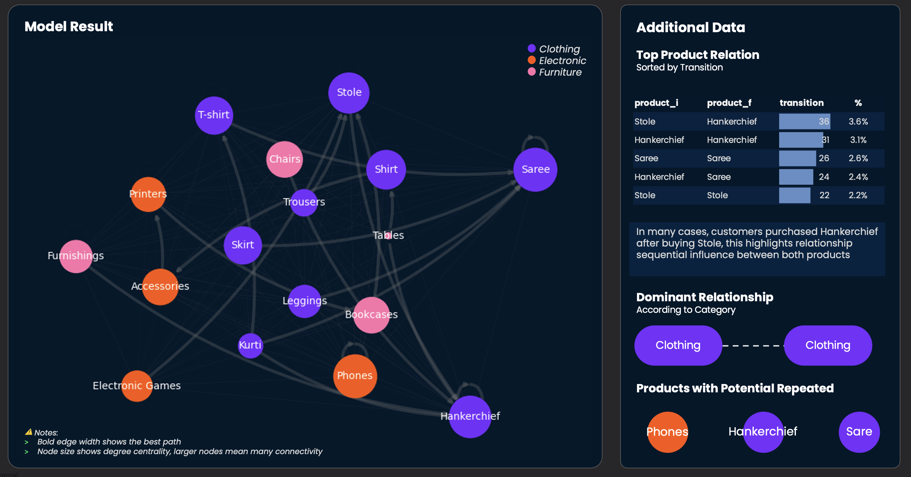


**Note** To keep it confidential, all company-specific metrics has been replaced by public dataset. 


## Background
### 💰 The revenue gap after a purchase

One of the effective campaigns to customers is introducing other products during the transaction. This approach has been applied in various ways such as e-commerce apps show other products through banners right when customers are doing the payment, or in minimarket, you probably found the storekeepers mentioning flash sale products to attract customers.

### 🗺️ Invisible pattern: products come in sequence

Surprisingly, some stores are smart enough to guess what the next products that the customers are morelikely to buy. For example, after purchasing a phone, storekeepers are going to offer phone case. In addition, if a customer comes to buy a case, then the next product wouldn't be a phone, but probably other gadget accessories. Therefore, customers choose items sequentially, and this model is going find the most natural best product according to sequential behavior.

### ⚛️ NetworkX to appraoch sequential model

In this article, we are going to use [NetworkX](https://networkx.org/documentation/stable/), a branch of graph theory, to explain natural behavior how customers decide purchasing an item accoring to their past behavior of choosing the others.

The analysis that will be discussed are the nodes, meaning the products including how frequent they are purchased, and the edge that refers to the best path of the next products. It is important to notes, in the calculation, only customers who made more than two transactions are involved to show natural transition moving from a product to another.

## 🛒 Implementing real scenario

The use case is retail products, covering three categories (clothes, electronic, and furniture) with total 17 disticnt products. The data has been cleansed in sql which then transformed into graph model. Therefor, for technical details, I suggest you to visit my github.


View on GitHub


### 📈 Graph result

The graph shows that almost all products related with each others, drawn by the scattered points that are connected. In addition, the hightlighted lines are configured to refer the most frequent transitin that is regarded as the highest occurance path of the next products. For eample, after choosing accessories, customers are most likelye purchase printers.

Overall, there are three products that are potentially purchased repeatedly, namely phones, hankerchief and saree. Yet, the other products tend to transitioning to the other. Most transition happened in Stole to Hankercief, calculated around 3.6% of total transition. 

### ⬆️ Incresing the probability

To enhance probability, instead of offering one product accoridng to the graph, it's also possible to offer other possible option by sorting the several highest possible products. The table above depicts the card that consist some options that are best to offer according each last transaction.

## 🎯 Further improvements

It is important to note that the application of this model depends on what types of the business. Consequently, it is suggested to support the model using test and learn, so the impact can be more reliable.

Moreover, this model can also be used to understand customer journey, that can be applied for helping customers finding products they want through personalized approach, such as product placement in application.
